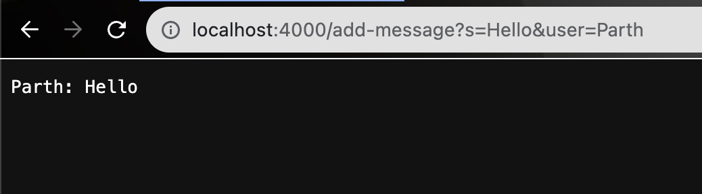
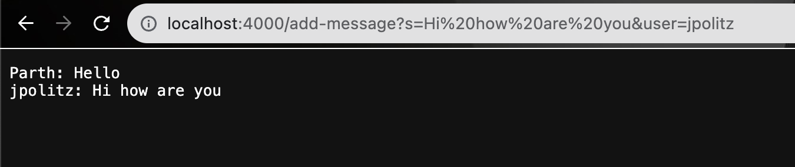

# CSE 15L Lab 2 Report
## By Parth Paliwal

`Part 1`
---

Which methods in your code are called?
handleRequest, .getQuery, .equals, getPath, .split, isEmpty, .add, String.join are some of the methods that are called.

What are the relevant arguments to those methods, and the values of any relevant fields of the class?
handleRequest takes in the url, getPath, getQuery and isEmpty take no arguments, .equals takes in the string value that is compared, .add takes in the message to be added, .equals takes the character to be split by.

How do the values of any relevant fields of the class change from this specific request? If no values got changed, explain why.
The messages list, user field, and message field values change.

Which methods in your code are called?
handleRequest, .getQuery, .equals, getPath, .split, isEmpty, .add, String.join are some of the methods that are called.

What are the relevant arguments to those methods, and the values of any relevant fields of the class?
handleRequest takes in the url, getPath, getQuery and isEmpty take no arguments, .equals takes in the string value that is compared, .add takes in the message to be added, .equals takes the character to be split by.

How do the values of any relevant fields of the class change from this specific request? If no values got changed, explain why.
The messages list, user field, and message field values change.

`Part 2`
---
